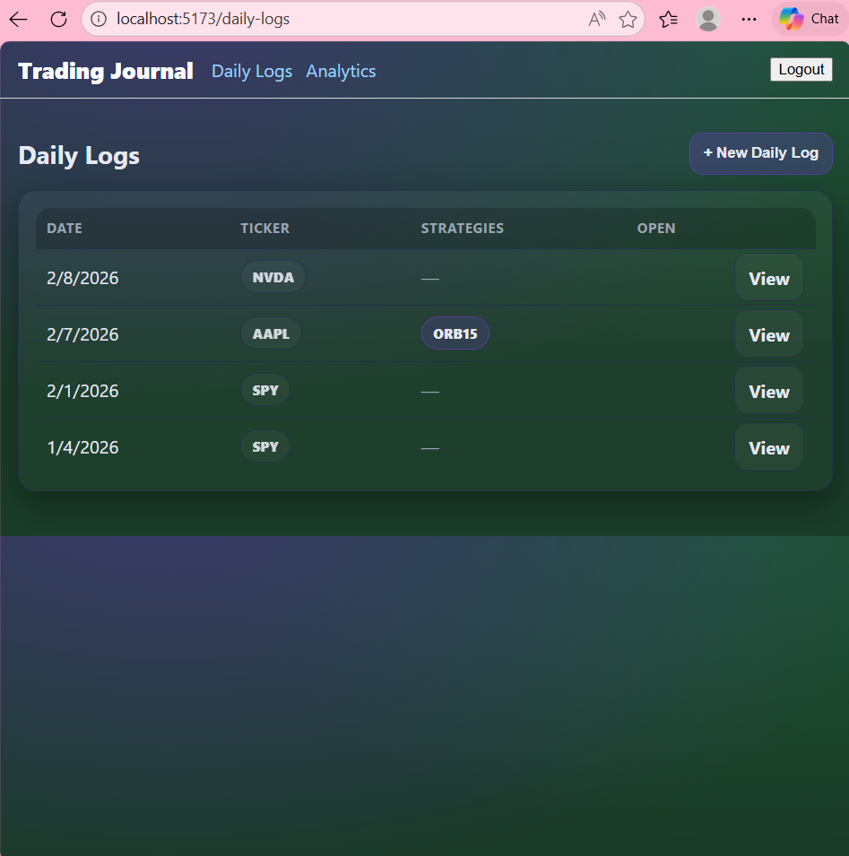
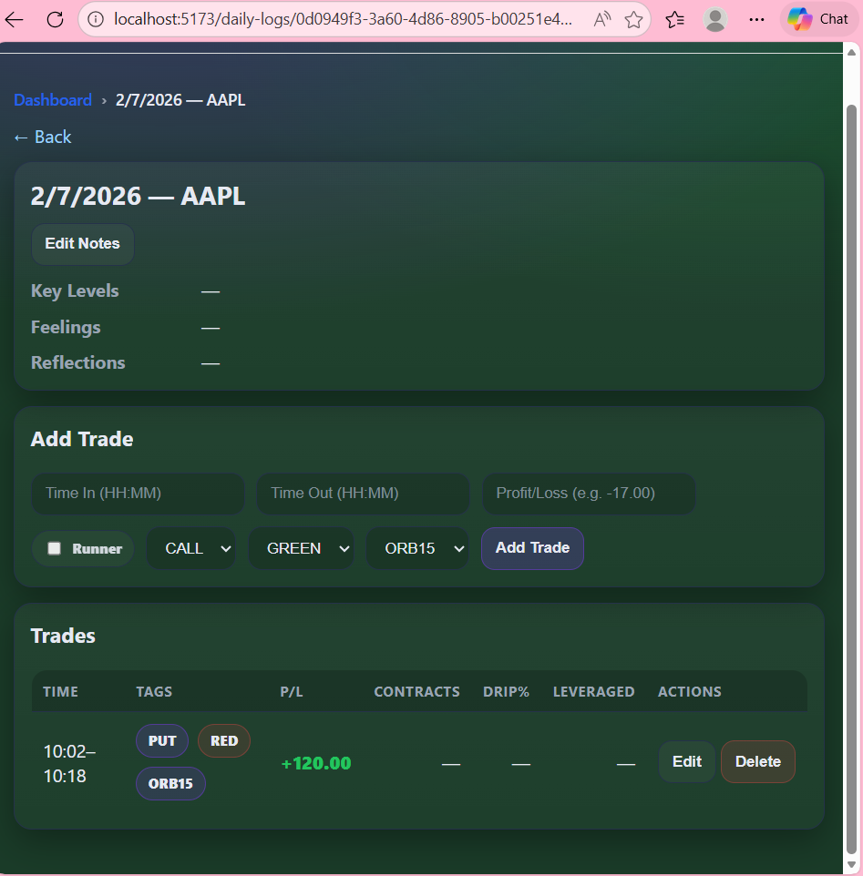
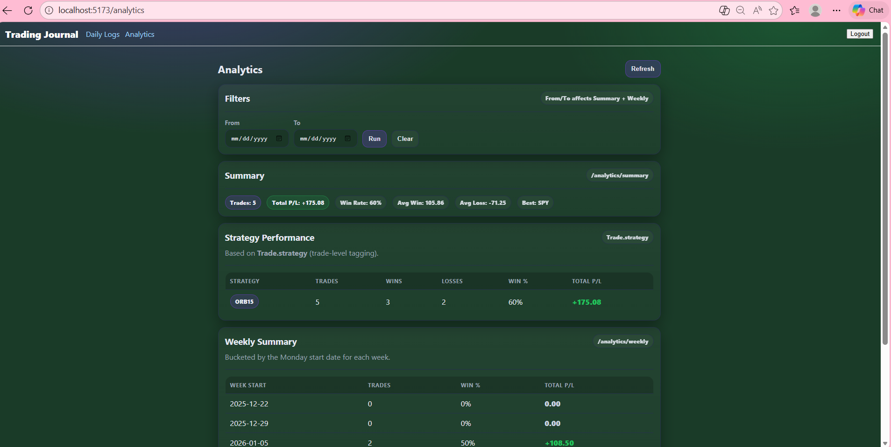
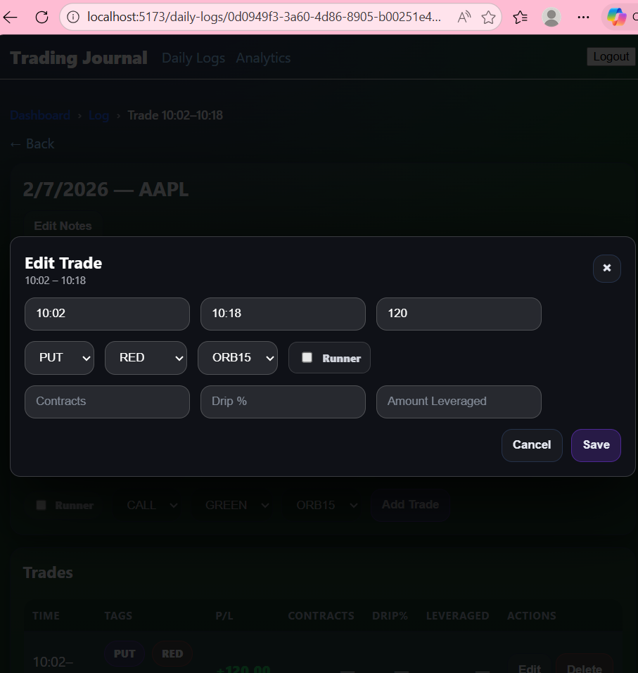

# Trading Journal UI

A React + Vite frontend for the Trading Journal application.

This application allows users to log trades, edit daily notes, and analyze performance through dashboards and analytics tables.

---
⚙️ Backend Repository:
https://github.com/KaylaArnold/trading-journal-api
This frontend connects to the Trading Journal API backend for authentication, daily logs, trades, and analytics.

## 🚀 Features

### Authentication
- Login screen
- JWT stored in localStorage
- Authorization header: `Bearer <token>`

### Daily Logs Dashboard
- Paginated list of daily logs
- Click into individual log details

### Daily Log Detail Page
- View log (date + ticker)
- Edit notes:
  - Key Levels
  - Feelings
  - Reflections
- Add trades
- Delete trades
- Trade table with:
  - CALL / PUT badge
  - GREEN / RED badge
  - Strategy badge (ORB15 / ORB5 / 3CONF)
  - Color-coded Profit/Loss
  - Contracts column
  - Drip % column
  - Amount Leveraged column

### Trade Edit Modal
- Opens from trade row
- Prefilled form fields
- PATCH update to backend
- UI refresh after save

### Analytics Page
- Summary performance cards
- Weekly breakdown table
- Strategy performance table
- Date filters (From / To)
- Refresh button

### Navigation / UX
- React Router
- Breadcrumb navigation
- Clickable app title routes back to dashboard
- Loading + error notices

---

## 🛠 Tech Stack

- React
- Vite
- React Router
- Fetch API
- Custom CSS styling

---

## 📂 Project Structure

```txt
public/
src/
  api/
  assets/
  components/
  pages/
```

---

## 📸 Screenshots

### Dashboard


### Daily Log


### Analytics


### Edit Trade Modal


---

## ⚙️ Run Locally

```bash
npm install
npm run dev
```

The app runs at:

```
http://localhost:5173
```

Backend must be running separately.

---

## 🔗 Related Repository

Backend API:
https://github.com/KaylaArnold/trading-journal-api
